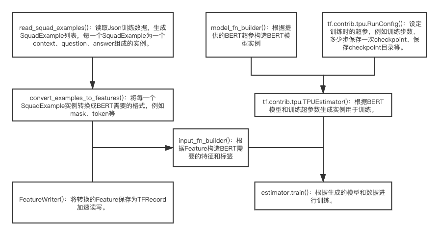

# 中文阅读理解任务
针对CMRC中文阅读理解任务的BERT机器阅读理解模型。
## 文件结构
```
$ tree -L 1
.
├── LICENSE                         
├── README.md
├── __init__.py
├── cmrc2018_evaluate.py            # 评测模型的准确率
├── modeling.py                     # BERT模型
├── optimization.py                 # 优化算法
├── run_cmrc2018.sh                 # 运行BERT模型bash脚本
├── run_cmrc2018_drcd_baseline.py   # 运行BERT模型python文件
├── output                           # 存放模型训练后的权重
├── squad_base                      # 训练集、验证集
├── tokenization.py                 # 中文分词
└── uncased_L-2_H-128_A-2           # BERT预训练权重，可从官方BERT GitHub下载
```

## 训练流程图



## 安装
```bash
tensorflow==1.15
```
## 使用方法
1. 从[BERT-Tity](https://storage.googleapis.com/bert_models/2020_02_20/uncased_L-2_H-128_A-2.zip)下载模型，存放在uncased_L-2_H-128_A-2文件夹下.
2. `bash run_cmrc2018.sh`

`bash run_cmrc2018.sh`中：
```bash
export PATH_TO_BERT=uncased_L-2_H-128_A-2
export DATA_DIR=output
export MODEL_DIR=/tmp/squad_base/
python run_cmrc2018_drcd_baseline.py \                     # 训练的入口python文件
	--vocab_file=${PATH_TO_BERT}/vocab_zh.txt \            # 指定模型需要的中文词典
	--bert_config_file=${PATH_TO_BERT}/bert_config.json \  # 指定bert的网络结构
	--do_train=True \                                      # 是否训练模型
	--init_checkpoint=${PATH_TO_BERT}/bert_model.ckpt \    # 加载的预训练检查点
	--train_file=${DATA_DIR}/cmrc2018_train.json \         # 训练数据
	--do_predict=True \                                    # 训练结束是否做预测
	--predict_file=${DATA_DIR}/cmrc2018_dev.json \         # 验证集
	--train_batch_size=32 \                                # batch size大小
	--num_train_epochs=50 \                                # epoch
	--max_seq_length=512 \                                 # 输入模型的最长句子
	--doc_stride=128 \
	--learning_rate=3e-5 \                                 # 学习率
	--save_checkpoints_steps=1000 \                        # 每1000个batch保存一次检查点
	--output_dir=${MODEL_DIR} \                            # 保存检查点位置
	--do_lower_case=True \                                 # 字母是否小写
	--use_tpu=False                                        # 是否使用TPU
```

## Evaluate

```
python cmrc2018_evaluate.py squad/cmrc2018_dev.json output/dev_predictions.json
```

结果：

```
{"AVERAGE": "10.601", "F1": "17.878", "EM": "3.324", "TOTAL": 3219, "SKIP": 0, "FILE": "output/dev_predictions.json"}
```

## 预测结果例子
### 上下文：

《战国无双3》（）是由光荣和ω-force开发的战国无双系列的正统第三续作。本作以三大故事为主轴，分别是以武田信玄等人为主的《关东三国志》，织田信长等人为主的《战国三杰》，石田三成等人为主的《关原的年轻武者》，丰富游戏内的剧情。此部份专门介绍角色，欲知武器情报、奥义字或擅长攻击类型等，请至战国无双系列1.由于乡里大辅先生因故去世，不得不寻找其他声优接手。从猛将传 and Z开始。2.战国无双 编年史的原创男女主角亦有专属声优。此模式是任天堂游戏谜之村雨城改编的新增模式。本作中共有20张战场地图（不含村雨城），后来发行的猛将传再新增3张战场地图。但游戏内战役数量繁多，部分地图会有兼用的状况，战役虚实则是以光荣发行的2本「战国无双3 人物真书」内容为主，以下是相关介绍。（注：前方加☆者为猛将传新增关卡及地图。）合并本篇和猛将传的内容，村雨城模式剔除，战国史模式可直接游玩。主打两大模式「战史演武」&「争霸演武」。系列作品外传作品

### 问题：

1. 《战国无双3》是由哪两个公司合作开发的？
2. 男女主角亦有专属声优这一模式是由谁改编的？
3. 战国史模式主打哪两个模式？

### 模型预测的答案：
1. 由光荣和ω-force开发的战国无双系列的正统第三续作。
2. 村雨城
3. 此模式是任天堂游戏谜之村雨城改编的新增模式。

## 参考
- [官方Github BERT](https://github.com/google-research/bert)
- [GitHub Chinese BERT](https://github.com/ymcui/Chinese-BERT-wwm)
- [CMRC2018的baseline](https://github.com/ymcui/cmrc2018/tree/master/baseline)